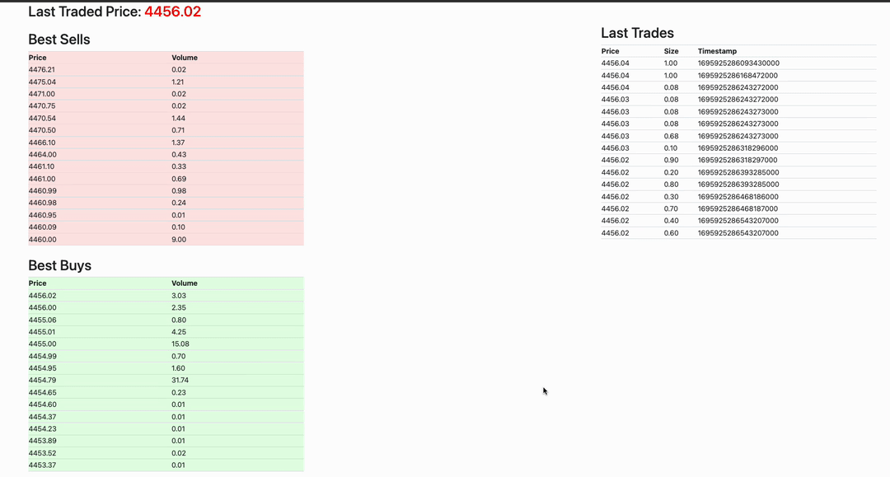
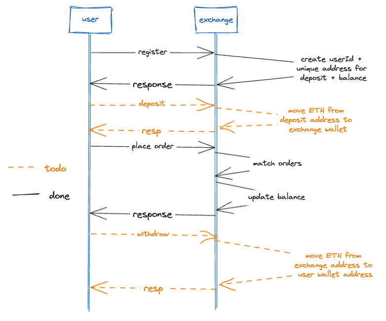
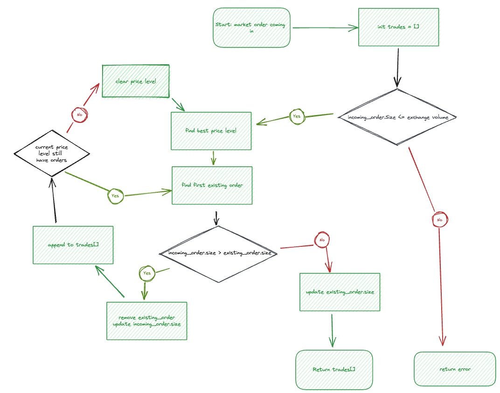
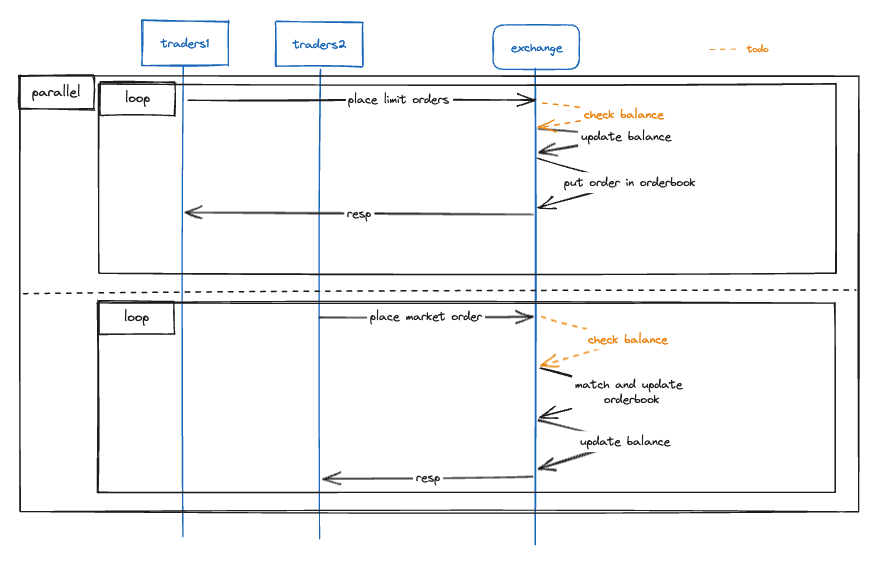

# Implementation of a Simple Crypto Exchange
- For learning Go + trading engine
- Orders matched uing Price-Time Priority
- Execution here is just users' balance management
- Simple market making
- REST APIs + WebSocket APIs provided

# Test
```
make build
make test
```

# Test
- Run
```
make run
```
The server is hardcoded to run at port `3000`.
- Launch the frontend.
https://github.com/trandinhkhoa/crypto_exchange_frontend
    - The frontend (hardcoded to run at port `8080`) is already hardcoded to connect to port `3000`.

# Demo
Demo with the Front-end mentioned above



# Roadmap


# Match
- Orderbook has 2 sides: buy and sell
- Price-Time priority matching
    - each side consists of multiple price levels (limits), sorted
    - each price level is a First-In-First-Out queue of orders



# General flow
- `trader 1` and `trader 2` is in `/client` folder, to simulate a mini live market




# API docs

## REST APIs

### 1. Place an Order

- **HTTP Method**: POST
- **Path**: `/order`
- **Request Body**:
    ```json
    {
    "UserId": "johnDoe",
    "OrderType": "LIMIT" | "MARKET",
    "IsBid": true | false,
    "Size": 1.0,
    "Price": 1.0,
    "Ticker": "ETHUSD"
    }
    ```
- **Response Body**: JSON object containing either `matches` for market orders or `msg` and `order` for limit orders.

### 2. Get All Users

- **HTTP Method**: GET
- **Path**: `/users`
- **Response Body**: JSON array of all users.
    ```json
    {
    "maker123": {
        "Balance": {
        "ETH": 9567,
        "USD": 29555.099999999293
        }
    },
    "me": {
        "Balance": {
        "ETH": 0,
        "USD": 1000
        }
    },
    "traderJoe123": {
        "Balance": {
        "ETH": -528,
        "USD": 538735.5000000062
        }
    }
    }
    ```

### 3. Get Specific User

- **HTTP Method**: GET
- **Path**: `/users/:userId`
- **Path Parameter**: `userId` - User ID
- **Response Body**: JSON object of the specified user.
    ```json
    {
    "Balance": {
        "ETH": 0,
        "USD": 1000
    }
    }
    ```

### 4. Get Order Book

- **HTTP Method**: GET
- **Path**: `/book/:ticker`
- **Path Parameter**: `ticker` - Ticker symbol .e.g ETHUSD
- **Response Body**: JSON object containing order book details.
    ```json
    "TotalAsksVolume": 1,
    "TotalBidsVolume": 1,
    "Asks": [
        {
        "ID": 803767546,
        "UserId": "jane",
        "IsBid": false,
        "Size": 1,
        "Price": 999.3999999999999,
        "Timestamp": 1696370360524191000
        },
    ],
    "Asks": [
        {
        "ID": 803767546,
        "UserId": "john",
        "IsBid": true,
        "Size": 1,
        "Price": 999.3999999999999,
        "Timestamp": 1696370360524191000
        },
    ],
    ```

### 5. Get Current Price

- **HTTP Method**: GET
- **Path**: `/book/:ticker/currentPrice`
- **Path Parameter**: `ticker` - Ticker symbol .e.g ETHUSD
- **Response Body**: JSON object with the `currentPrice` field.
    ```json
    {
        "currentPrice": 999.3999999999999
    }
    ```

### 6. Get Best Ask Price

- **HTTP Method**: GET
- **Path**: `/book/:ticker/bestAsk`
- **Path Parameter**: `ticker` - Ticker symbol .e.g ETHUSD
- **Response Body**: JSON object with the `bestAskPrice` field.
    ```json
    {
        "bestAskPrice": 999.3999999999999
    }
    ```

### 7. Get Best Bid Price

- **HTTP Method**: GET
- **Path**: `/book/:ticker/bestBid`
- **Path Parameter**: `ticker` - Ticker symbol
- **Response Body**: JSON object with the `bestBidPrice` field.
    ```json
    {
        "bestBidPrice": 999.3999999999999
    }
    ```

### 8. Cancel Order

- **HTTP Method**: DELETE
- **Path**: `/order/:ticker/:id`
- **Path Parameters**:
  - `ticker` - Ticker symbol .e.g. ETHUSD
  - `id` - Order ID
- **Response Body**: JSON object with `msg` field.
    ```json
    {
    "msg": "order cancelled"
    }
    ```

## WebSocket APIs

### 1. Current Price

- **Path**: `/ws/currentPrice`
- **Data**: Current price is sent to the connected client.
    ```json
    {
        "currentPrice": 999.3999999999999
    }
    ```

### 2. Last Trades

- **Path**: `/ws/lastTrades`
- **Data**: Last 15 trades are sent to the connected client.
    ```json
    [
        {
            "Price": 999.3999999999999,
            "Size": 1,
            "IsBuyerMaker": false,
            "Timestamp": 1696370597675928000
        },
    ]
    ```

### 3. Best Sells

- **Path**: `/ws/bestSells`
- **Data**: Best 15 sell limits are sent to the connected client.
    ```json
    [
    {
        "Price": 999.3999999999999,
        "Volume": 1060
    }
    ]
    ```

### 4. Best Buys

- **Path**: `/ws/bestBuys`
- **Data**: Best 15 buy limits are sent to the connected client.
    ```json
    [
    {
        "Price": 999.3999999999999,
        "Volume": 1060
    }
    ]
    ```